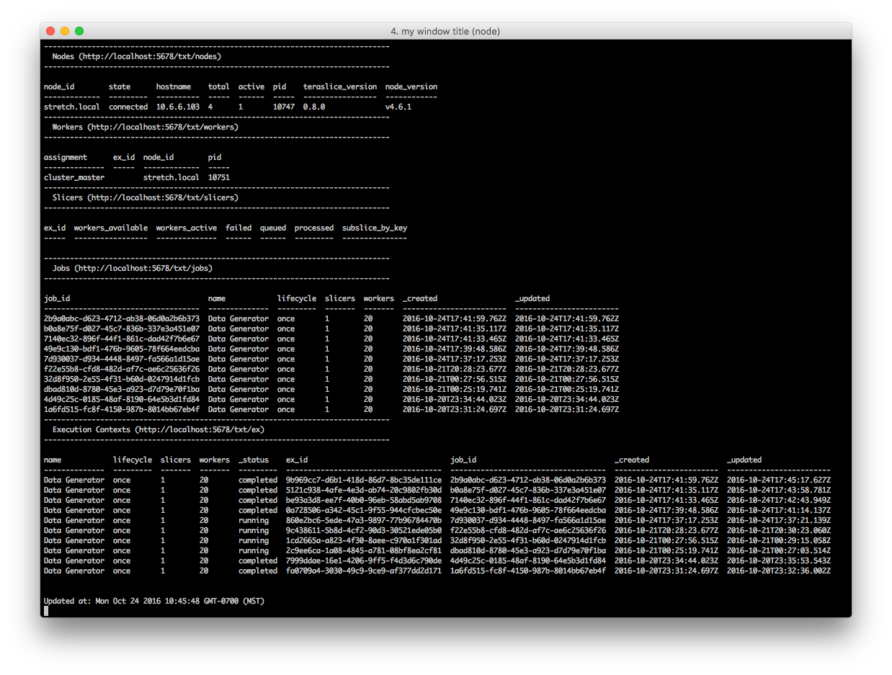

# Teraslice Top (ts-top)

Simple top-like tool for monitoring a [Teraslice](https://github.com/terascope/teraslice)
cluster.

[](https://travis-ci.org/godber/teraslice-top)

This currently only has basic functionality of showing Teraslice Nodes, Workers,
Slicers, Jobs and Execution Contexts.  There is not much in the way of
configuration yet.  You will have to resize your screen to see all of the
output and use `Ctrl+C` to exit it at this point.

# Installation

It can be installed directly from github using the following command:

```
npm install godber/teraslice-top
```

# Usage information

```
Usage: ts-top [options] [host]

Options:
  -p, --port     Port of Teraslice master node          [number] [default: 5678]
  -t, --timeout  Time between refresh (seconds)            [number] [default: 2]
  -h, --help     Show help                                             [boolean]

Examples:
  ts-top -p 45678 10.0.0.12
```

# Examples

Running `ts-top` will result in a screen similar to that shown below:


